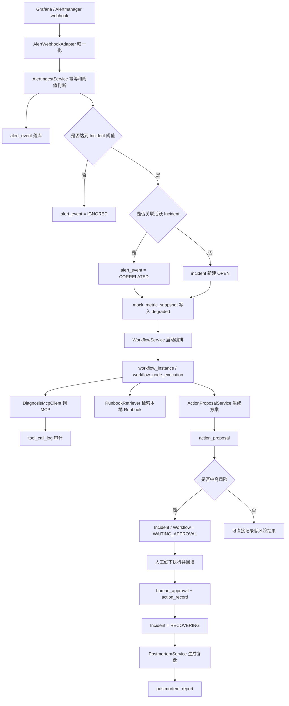

# 后端代码运作导读

本文档面向第一次接手 `ai-incident-copilot` 的开发者，重点解释 Java 后端、MCP 诊断、数据库流转和脚本运行方式。前端只作为演示入口简略说明，业务迭代请优先阅读本文、`docs/API.md`、`docs/DATABASE_SCHEMA.md` 和 `docs/RUNNING.md`。

## 1. 项目定位

AI Incident Copilot 是一个智能故障协同处理系统。它不直接重启服务、回滚发布或执行 SQL，而是围绕“被关注告警”完成以下闭环：

1. 接收 Grafana、Alertmanager 或业务系统推送的告警。
2. 幂等落库并判断是否达到创建 Incident 的阈值。
3. 创建或关联 Incident，记录指标快照。
4. 启动固定节点式 Workflow，收集指标、MCP 诊断证据和本地 Runbook。
5. 生成处置建议，并按风险级别进入人工确认。
6. 人工在线下执行动作后回填结果，系统记录审计和恢复观察。
7. 生成复盘报告并关闭 Incident。

## 2. 目录职责

```text
backend/src/main/java/com/example/incidentcopilot/
  alert/       告警 webhook 适配、入站幂等、阈值判断、Incident 关联
  incident/    Incident 创建、查询、详情、状态流转
  workflow/    固定节点式编排引擎、上下文、节点执行审计
  diagnosis/   diagnosis-service MCP JSON-RPC 客户端和诊断证据模型
  runbook/     本地 Markdown Runbook 检索
  action/      候选处置方案、审批、线下执行结果记录
  metrics/     演示指标快照写入和查询
  report/      结构化复盘报告生成和读取
  audit/       MCP 工具调用审计
  common/      API 响应、异常、CORS、JSON、业务常量
  demo/        本地演示故障入口
  system/      健康检查
```

核心分层约定：

- Controller 负责 HTTP 入参、响应包装和路由。
- Service 负责业务流程编排和事务边界。
- Repository 负责 SQL 读写，不承载业务判断。
- WorkflowNode 负责一个可审计的业务步骤，必须返回 `NodeResult`。
- `common/DomainConstants.java` 保存跨模块共享状态、风险等级和 context key，新增状态时优先维护这里。

## 3. 主业务链路

### 3.1 告警进入系统

入口代码：

- `AlertController`
- `AlertWebhookAdapter`
- `AlertIngestService`
- `AlertEventRepository`
- `IncidentService`

处理顺序：

1. `AlertController` 接收 `/api/alerts/grafana` 或 `/api/alerts/alertmanager`。
2. `AlertWebhookAdapter` 把外部 payload 转成内部 `AlertIngestRequest`。新增告警源时，也建议先做一个 adapter，不要把外部字段名传到 Service。
3. `AlertIngestService.ingest` 使用 `eventId` 幂等去重，重复事件直接返回旧处理结果。
4. 原始 payload 写入 `alert_event.raw_payload_json`，保证后续可以解释 Incident 的来源。
5. 系统根据错误率、p95、影响请求数或异常摘要判断是否 actionable。
6. 如果未达到阈值，`alert_event.status` 更新为 `IGNORED`。
7. 如果达到阈值，先按 `serviceName + traceId/endpoint` 查找未关闭 Incident。
8. 找到活跃 Incident 时，记录告警指标快照并把告警标记为 `CORRELATED`。
9. 找不到时，通过 `IncidentService.createFromAlert` 创建新 Incident，并把告警标记为 `INCIDENT_CREATED`。

关键数据写入：

- `alert_event`: 保存外部告警原文和入站决策。
- `incident`: 保存故障主记录。
- `mock_metric_snapshot`: 保存告警携带的错误率、延迟和 qps。

### 3.2 Incident 启动 Workflow

入口代码：

- `WorkflowController`
- `WorkflowService`
- `WorkflowEngine`
- `workflow/nodes/*`

处理顺序：

1. 调用 `/api/incidents/{id}/start-workflow`。
2. `WorkflowService` 检查 Incident 是否已关闭。已关闭的 Incident 不能重新启动 Workflow。
3. 如果最新 Workflow 仍是 `RUNNING` 或 `WAITING_APPROVAL`，直接返回最新实例，避免重复生成处置方案。
4. Incident 状态更新为 `WORKFLOW_RUNNING`。
5. 创建 `workflow_instance`，状态初始为 `CREATED`。
6. `WorkflowEngine` 按 `@Order` 顺序同步执行所有 `WorkflowNode`。
7. 每个节点成功后写入 `workflow_node_execution`，保存输入、输出、状态和耗时。
8. 节点失败时也会补一条失败执行记录，并把 Workflow 标记为 `FAILED`，Incident 标记为 `FAILED`。

当前节点顺序：

| 顺序 | 节点 | 作用 |
| --- | --- | --- |
| 10 | `AlertReceiverNode` | 固化 Incident 基础信息，作为时间线第一步 |
| 20 | `MetricsCollectorNode` | 写入/读取当前指标快照 |
| 30 | `DiagnosisMcpNode` | 调用 diagnosis-service MCP tools 收集诊断证据 |
| 40 | `RunbookRetrieverNode` | 在 `runbooks/` 中检索匹配 Runbook |
| 50 | `SeverityClassifierNode` | 根据可解释规则更新 P1/P2/P3 |
| 60 | `ActionPlanGeneratorNode` | 生成低、中、高风险候选处置方案 |
| 70 | `RiskReviewNode` | 判断是否需要人工确认 |
| 80 | `HumanApprovalNode` | 中高风险进入等待人工确认 |

### 3.3 MCP 诊断和 fallback

入口代码：

- `DiagnosisMcpNode`
- `DiagnosisMcpClient`
- `ToolCallLogger`

`DiagnosisMcpClient.collectEvidence` 会按顺序调用 diagnosis-service 的 MCP tools：

- `search_logs`
- `search_code`
- `search_tickets`
- `generate_report`

所有工具调用都会写入 `tool_call_log`，包括请求、响应、耗时、成功状态和错误信息。

默认配置 `DIAGNOSIS_MCP_FALLBACK_ENABLED=true`。当 diagnosis-service 不可用时，系统会写入失败审计，并返回模板化诊断证据，保证演示链路继续运行。真实链路验收时建议设置：

```env
DIAGNOSIS_MCP_FALLBACK_ENABLED=false
```

关闭 fallback 后，MCP 调用失败会让 Workflow 失败，便于验证真实依赖是否可用。

### 3.4 Runbook 检索

入口代码：

- `RunbookRetrieverNode`
- `RunbookRetriever`

`RunbookRetriever` 从 `RUNBOOK_DIR` 指向的目录读取 Markdown 文件，按文件名、标题、正文和 Incident 关键词做轻量打分，返回 Top 3。当前策略刻意保持透明，方便面试、演示和问题定位。未来如果接向量检索，可以保留 `RunbookRetriever.search` 的方法签名，把内部实现替换为向量库或混合检索。

### 3.5 处置方案和人工确认

入口代码：

- `ActionPlanGeneratorNode`
- `RiskReviewNode`
- `HumanApprovalNode`
- `ActionProposalService`
- `ActionProposalRepository`

`ActionProposalService.generateDefaults` 生成三类建议：

- `LOW`: 低风险，通常是观察、补日志、补证据，可以直接记录。
- `MEDIUM`: 中风险，按 Incident 文本匹配支付、订单、RAG、Qdrant、AI 服务、SSE、GraphRAG 等场景，必须人工确认。
- `HIGH`: 高风险，例如回滚或配置切换，只生成建议，不自动执行。

重要边界：

- 系统只生成方案、记录审批、记录线下执行结果。
- 系统不会调用生产回滚、扩缩容、SQL、配置中心或重启接口。
- `recordResult` 表示“人已经在线下执行，并把结果回填到系统”。

记录执行结果后：

1. 写入 `human_approval`，decision 为 `MARK_OFFLINE_EXECUTED`。
2. 写入 `action_record`。
3. 当前 action 更新为 `OFFLINE_EXECUTED`。
4. 同一 Incident 的其他候选 action 更新为 `NOT_SELECTED`。
5. Incident 更新为 `RECOVERING`。
6. `IncidentMetricsService` 写入 recovering 指标快照。

### 3.6 复盘报告

入口代码：

- `PostmortemController`
- `PostmortemService`
- `PostmortemRepository`

`PostmortemService.generate` 会读取 Incident、最新 Workflow 节点、已执行 action，生成：

- summary
- root cause
- impact
- action items
- prevention items
- Markdown 报告内容

数据写入 `postmortem_report`，同一 Incident 使用 upsert，重复生成会覆盖最新复盘内容。

## 4. 数据流转总览



## 5. 关键状态字典

运行时代码中的共享状态集中在 `common/DomainConstants.java`。

| 领域 | 状态 |
| --- | --- |
| Incident | `OPEN`, `WORKFLOW_RUNNING`, `WAITING_APPROVAL`, `RECOVERING`, `CLOSED`, `FAILED` |
| Workflow | `RUNNING`, `SUCCESS`, `WAITING_APPROVAL`, `FAILED` |
| Severity | `P1`, `P2`, `P3` |
| Risk Level | `LOW`, `MEDIUM`, `HIGH` |
| Action Status | `READY`, `PENDING`, `APPROVED`, `REJECTED`, `ESCALATED`, `OFFLINE_EXECUTED`, `NOT_SELECTED` |
| Metric Status | `degraded`, `recovering`, `recovered` |

如果要新增状态，建议同时检查：

- `DomainConstants`
- `docs/DATABASE_SCHEMA.md`
- 前端状态展示
- 相关单元测试
- 数据库注释或迁移脚本

## 6. 本地脚本和运行方式

常用脚本：

| 脚本 | 作用 |
| --- | --- |
| `scripts/init-db.sh` | 在相邻 `ai-agent-infra-stack` 的 MySQL 中创建 database 和账号 |
| `scripts/start-local.sh` | 宿主机启动 Spring Boot 后端和 Vite 前端 |
| `scripts/stop-local.sh` | 停止本地端口进程 |
| `scripts/status-local.sh` | 查看本地端口占用 |
| `scripts/logs.sh` | 查看后端、错误、前端或 Docker 日志 |
| `scripts/start-docker.sh` | Docker Compose 启动项目 |
| `scripts/stop-docker.sh` | Docker Compose 停止项目 |
| `scripts/smoke-test.sh` | 只通过 HTTP API 跑完整后端闭环 |

推荐开发顺序：

```bash
scripts/init-db.sh
scripts/start-local.sh
BASE_URL=http://localhost:8080/api scripts/smoke-test.sh
```

`scripts/smoke-test.sh` 覆盖的链路是：健康检查、注入 Grafana 告警、创建 Incident、启动 Workflow、检查节点和工具审计、记录处置结果、检查 recovering 指标、生成复盘、关闭 Incident。

## 7. 新功能迭代建议

### 新增告警源

1. 在 `AlertWebhookAdapter` 增加一个转换方法，或新建 adapter。
2. 在 `AlertController` 暴露新 endpoint。
3. 复用 `AlertIngestService.ingest`，不要绕过入站幂等和阈值判断。
4. 增加 adapter 单测或 service 单测。

### 新增 Workflow 节点

1. 实现 `WorkflowNode`。
2. 用 `@Order` 放到合适位置。
3. 输入从 `WorkflowContext` 读取，输出写入 `NodeResult`。
4. 若影响最终状态，通过 `DomainConstants.WorkflowContextKey` 写入 context。
5. 增加节点单测，并确认 `workflow_node_execution` 输出对前端时间线友好。

### 接入真实监控指标

1. 保留 `IncidentMetricsService` 对外方法。
2. 新增监控 Provider，从 Prometheus/Grafana 查询真实数据。
3. 将查询结果写入 `mock_metric_snapshot` 或新建正式快照表。
4. 保持 `MetricSnapshot` 响应结构稳定，减少前端改动。

### 接入真实 LLM 生成方案或复盘

1. 保留 `ActionProposalService.generateDefaults` 的风险门禁语义。
2. LLM 输出必须转换为固定 action status、risk level 和 action type。
3. 中高风险仍必须走 `HumanApprovalNode`。
4. Prompt 可从 `prompts/` 目录扩展。

## 8. 快速排障

- 后端启动失败：先看 `.run/backend-launcher.log`，再看 `logs/backend/incident-copilot-error.log`。
- 数据库连接失败：确认 `scripts/init-db.sh` 已执行，且 `ai-agent-infra-stack` 的 MySQL 在 `localhost:3306`。
- Workflow 卡在等待：检查是否存在中高风险 action，调用 `/api/incidents/{id}/actions` 后记录结果。
- MCP 调用失败但流程继续：这是 fallback 模式，查看 `tool_call_log.success=false` 的审计记录。
- 严格 MCP 验收失败：设置 `DIAGNOSIS_MCP_FALLBACK_ENABLED=false` 后，确认 diagnosis-service 地址和 token。

## 9. 阅读代码推荐顺序

1. `AlertIngestService`
2. `IncidentService`
3. `WorkflowService`
4. `WorkflowEngine`
5. `workflow/nodes/*`
6. `DiagnosisMcpClient`
7. `ActionProposalService`
8. `PostmortemService`
9. `docs/DATABASE_SCHEMA.md`
10. `scripts/smoke-test.sh`
