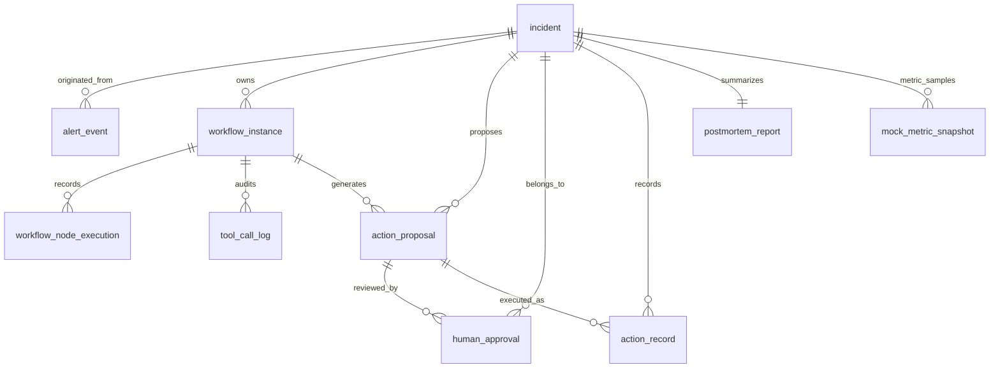

# 数据库 Schema 说明

本文档解释 `database/schema.sql` 与 Flyway 迁移 `backend/src/main/resources/db/migration/` 中的核心表。运行时 MySQL 由 `ai-agent-infra-stack` 统一管理，本项目使用独立 database `incident_copilot` 和独立用户 `incident_copilot`。

## 设计原则

- `alert_event` 是外部业务告警、APM、日志平台事件进入系统的第一跳，`incident` 是归因和阈值判断后的故障处理主实体。
- `scripts/init-db.sh` 负责创建 database 和专用用户，业务表由 Flyway 初始化。
- `workflow_instance` 记录一次自动化协同流程，`workflow_node_execution` 记录每个节点的输入、输出、状态和耗时。
- `tool_call_log` 单独保存 MCP/工具调用审计，便于证明 AI 或外部工具使用了哪些证据。
- 中高风险动作只进入 `action_proposal`、`human_approval`、`action_record`，系统不直接执行真实生产操作。
- JSON 字段用于保存演示期快速迭代的结构化证据；稳定后可以拆成明细表。

## 表关系

## 核心表说明

| 表 | 作用 | 关键字段 |
| --- | --- | --- |
| `alert_event` | 原始入站告警事件，保存上游事件、指标、原始 payload、入站决策和 Incident 关联 | `event_id`, `source`, `signal_name`, `service_name`, `incident_id`, `status`, `raw_payload_json` |
| `incident` | 故障单主表，承载告警来源、服务、严重级别、状态和链路线索 | `incident_no`, `service_name`, `severity`, `status`, `trace_id`, `exception_type` |
| `workflow_instance` | 一次固定节点式故障处理 Workflow 的运行实例 | `incident_id`, `workflow_type`, `status`, `current_node`, `started_at`, `finished_at` |
| `workflow_node_execution` | 节点级执行流水，用于前端时间线、失败定位和重试基础 | `node_name`, `node_type`, `status`, `input_json`, `output_json`, `duration_ms` |
| `tool_call_log` | MCP 或外部工具调用审计，保存请求、响应、成功状态和耗时 | `tool_name`, `request_json`, `response_json`, `success`, `error_message` |
| `action_proposal` | 候选处置方案与风险分级，系统只生成建议和审批卡片 | `action_type`, `risk_level`, `requires_approval`, `status`, `evidence_json` |
| `human_approval` | 人工审批/驳回/升级/记录处置结果的决策记录 | `decision`, `approved_by`, `approved_at`, `comment` |
| `action_record` | 人工在线下执行后的结果记录，不代表系统自动执行生产动作 | `action_type`, `executor`, `result`, `result_detail`, `executed_at` |
| `postmortem_report` | 一次故障的复盘报告和结构化改进项 | `summary`, `root_cause`, `timeline_json`, `action_items_json`, `report_content` |
| `mock_metric_snapshot` | Incident 指标快照表；当前沿用历史表名，数据来自告警 payload 和演示状态机，后续可替换为真实监控 Provider | `error_rate`, `p95_latency`, `qps`, `status`, `snapshot_time` |

## 状态约定

| 领域 | 常用状态 | 说明 |
| --- | --- | --- |
| Alert Event | `RECEIVED`, `IGNORED`, `INCIDENT_CREATED`, `CORRELATED` | 原始告警入站处理结果 |
| Incident | `OPEN`, `WORKFLOW_RUNNING`, `WAITING_APPROVAL`, `RECOVERING`, `FAILED`, `CLOSED` | 故障单生命周期状态 |
| Workflow | `CREATED`, `RUNNING`, `SUCCESS`, `WAITING_APPROVAL`, `FAILED` | 自动化流程运行状态 |
| Node Execution | `PENDING`, `RUNNING`, `SUCCESS`, `FAILED` | 单节点执行状态 |
| Action Proposal | `READY`, `PENDING`, `APPROVED`, `REJECTED`, `ESCALATED`, `OFFLINE_EXECUTED` | 处置方案处理状态 |
| Human Approval | `APPROVED`, `REJECTED`, `ESCALATED`, `MARK_OFFLINE_EXECUTED` | 人工决策类型 |
| Incident Metrics | `normal`, `degraded`, `recovering`, `recovered` | Incident 恢复观察状态 |

## JSON 字段约定

- `workflow_node_execution.input_json`: 节点执行入参快照，便于复盘当时上下文。
- `alert_event.raw_payload_json`: 上游系统原始 payload，便于解释 Incident 从哪里来。
- `workflow_node_execution.output_json`: 节点输出结果，例如诊断证据、Runbook 命中、风险判断。
- `tool_call_log.request_json`: MCP JSON-RPC 请求体。
- `tool_call_log.response_json`: MCP 返回内容或 fallback 证据。
- `action_proposal.evidence_json`: 生成处置方案时引用的诊断摘要、Runbook、严重级别等证据。
- `postmortem_report.timeline_json`: 复盘时间线。
- `postmortem_report.action_items_json`: 后续行动项。
- `postmortem_report.prevention_items_json`: 预防类改进项。

## 索引意图

- `idx_incident_service_status`: 支持按服务和状态筛选故障列表。
- `idx_alert_service_time`: 支持按服务和入站时间追踪原始告警。
- `idx_alert_trace_id`: 支持通过 trace id 将告警关联到 Incident。
- `idx_incident_created_at`: 支持按创建时间倒序展示最近故障。
- `idx_incident_trace_id`: 支持从链路追踪 ID 反查故障。
- `idx_workflow_incident`, `idx_node_workflow`, `idx_tool_workflow`: 支持详情页聚合 Workflow、节点和工具调用。
- `idx_action_incident`, `idx_action_status`, `idx_action_risk`: 支持处置方案卡片按故障、状态和风险筛选。
- `idx_metric_incident_time`: 支持按时间展示某次故障的指标变化曲线。
