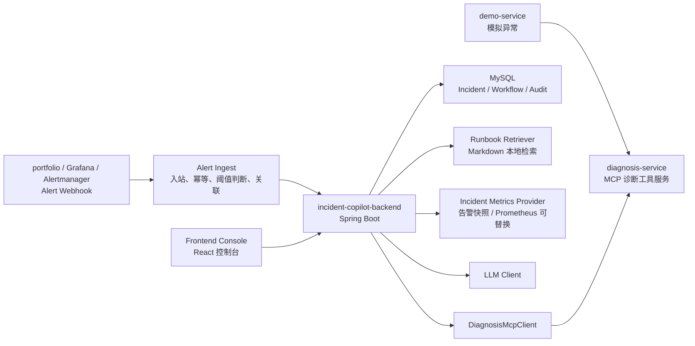
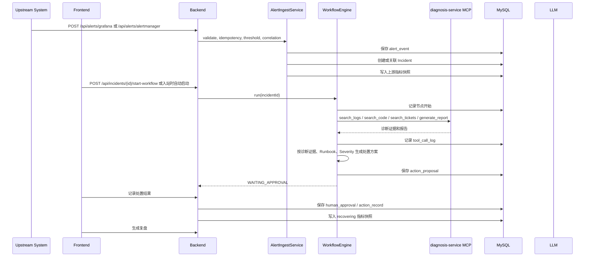
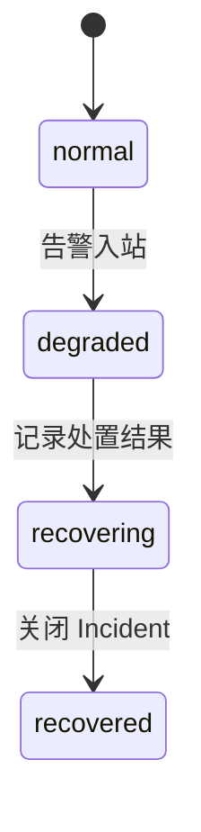

# 技术设计：AI Incident Copilot

## 1. 总体架构



`diagnosis-service` 负责回答“异常可能是什么原因，有哪些证据”。`AI Incident Copilot` 负责回答“一次故障应该如何从告警、诊断、决策、记录到复盘被协同处理”。

## 2. 后端模块

```text
com.example.incidentcopilot
  alert
    AlertController
    AlertIngestService
    AlertEventRepository
  incident
    IncidentController
    IncidentService
    IncidentRepository
  workflow
    WorkflowController
    WorkflowEngine
    WorkflowContext
    WorkflowNode
    nodes/*
  diagnosis
    DiagnosisMcpClient
    DiagnosisMcpProperties
  metrics
    IncidentMetricsService
    MetricsController
  runbook
    RunbookRetriever
    RunbookDocument
  action
    ActionProposalController
    ActionProposalService
    HumanApprovalService
  report
    PostmortemService
  llm
    LlmClient
    PromptTemplateLoader
  audit
    ToolCallLogger
    WorkflowNodeExecutionLogger
  common
    ApiResponse
    JsonUtils
    ErrorCode
```

## 3. Workflow 执行模型

MVP 使用固定顺序节点，不做拖拽画布和复杂异步调度。`WorkflowEngine` 负责按顺序执行节点，每个节点实现统一接口：

```java
public interface WorkflowNode {
    String name();
    NodeResult execute(WorkflowContext context);
}
```

每个节点执行前后都写入 `workflow_node_execution`。异常处理规则：

- 节点开始时状态为 `RUNNING`。
- 成功后状态为 `SUCCESS`，写入 `output_json`。
- 失败后状态为 `FAILED`，写入 `error_message`。
- 失败时 Workflow 状态为 `FAILED`，保留已完成节点结果。
- 页面允许用户重试失败节点，重试时复用同一个 Workflow 实例并新增节点执行记录。

## 4. 业务流程



## 5. MCP 调用设计

`DiagnosisMcpClient` 封装 `diagnosis-service` MCP endpoint。

核心方法：

- `listTools()`
- `callTool(String toolName, Map<String, Object> arguments)`
- `searchLogs(service, traceId, level, hours)`
- `searchCode(service, query)`
- `searchTickets(service, symptom)`
- `generateReport(service, traceId, message)`
- `getReport(reportId)`

每次调用必须通过 `ToolCallLogger` 写入 `tool_call_log`：

- `workflow_instance_id`
- `node_name`
- `tool_name`
- `request_json`
- `response_json`
- `success`
- `error_message`
- `duration_ms`

失败策略：

- `DiagnosisMcpNode` 标记为 `FAILED`。
- Workflow 标记为 `FAILED`。
- 页面展示失败原因。
- 允许重试节点。
- 已完成节点和工具调用日志保留。

## 6. Runbook 检索设计

MVP 使用本地 Markdown 文件和关键词检索。

目录：

```text
runbooks/
  payment-callback-timeout.md
  order-create-npe.md
  dependency-unavailable.md
  database-slow-query.md
  redis-cache-failure.md
  portfolio-rag-retrieval-empty.md
  portfolio-qdrant-unavailable.md
  portfolio-ai-service-timeout.md
  portfolio-sse-stream-interrupted.md
  portfolio-knowledge-ingestion-failure.md
  portfolio-graphrag-fallback-failure.md
```

检索输入：

- service_name
- endpoint
- exception_type
- title
- diagnosis summary

简单打分规则：

- 文件名命中：+5。
- 标题命中：+3。
- 适用场景命中：+3。
- 症状和常见原因命中：+2。
- 普通正文关键词命中：+1。

MVP 取 Top 1 到 Top 3 Runbook，写入 Workflow 上下文和节点输出。

Runbook 的定义原则见 `docs/RUNBOOKS.md`。它按故障类型沉淀处置知识，不按每个异常写死流程；具体证据由 `diagnosis-service` MCP 工具在运行时补齐。

## 7. LLM 使用边界

LLM 用于：

- 诊断摘要。
- 候选处置方案。
- 风险解释。
- 复盘报告。

LLM 不用于：

- 自动执行危险操作。
- 绕过人工确认。
- 修改生产配置。
- 执行 SQL。
- 直接关闭 Incident。

LLM 输出必须是结构化 JSON。后端需要做 JSON Schema 校验、字段兜底和风险等级二次校验。若 LLM 输出不可解析，节点失败并允许重试。

## 8. 风险分级规则

风险等级：

- `LOW`：通知、补充日志、创建后续任务、查询证据、观察指标。
- `MEDIUM`：开启降级、调整重试策略、限流、临时切换开关。
- `HIGH`：回滚、变更生产配置、数据库索引变更、执行 SQL、扩缩容。

审批规则：

- `LOW`：可直接生成记录或建议。
- `MEDIUM`：必须人工确认。
- `HIGH`：只能生成建议和审批卡片，必须人工确认，系统不得自动执行。

## 9. Incident Metrics Snapshots

当前版本把指标快照落在 `mock_metric_snapshot` 表中，表名保留是为了兼容已有迁移；对外语义是 Incident 指标快照。快照来源包括：

- 告警入站时从 Grafana / Alertmanager payload 提取的错误率、p95、QPS、影响请求数。
- 人工记录处置结果后写入的 `recovering` 快照，用于表达进入恢复观察。
- 关闭 Incident 后写入的 `recovered` 快照，用于表达恢复确认完成。

生产化时应抽象为 `MetricsProvider`，由 `PrometheusMetricsProvider`、`GrafanaMimirMetricsProvider` 或内部监控适配器读取真实时间序列；Workflow 节点和前端不需要关心底层来源。

状态机：



示例数值：

| 状态 | error_rate | p95_latency | qps |
| --- | ---: | ---: | ---: |
| normal | 0.2 | 180 | 120 |
| degraded | 6.8 | 3200 | 160 |
| recovering | 1.2 | 600 | 130 |
| recovered | 0.2 | 180 | 120 |

## 10. 安全与审计

- 所有节点执行写入 `workflow_node_execution`。
- 所有工具调用写入 `tool_call_log`。
- 所有人工操作写入 `human_approval` 和 `action_record`。
- 对中高风险动作，系统只保存建议、审批和线下执行记录。
- 前端必须在卡片上明确展示风险等级、证据来源、影响范围和前置检查。

## 11. Docker Compose 设计

组件：

- `incident-copilot-backend`
- `incident-copilot-frontend`
- `mysql`
- `diagnosis-service`
- `demo-service`

如果复用已有 `../diagnosis-service`，可以通过 compose 的 `build.context` 指向该目录；如果单独启动，也可在 README 中说明启动顺序。
